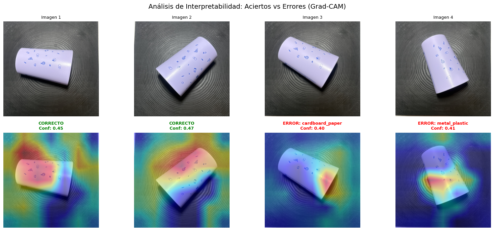
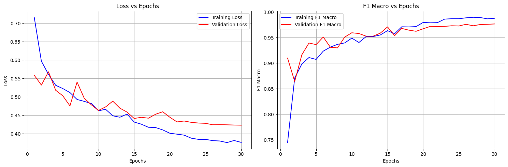

# Recyclable Waste Classifier

**MobileNetV3 transfer learning for 4-class waste sorting, with Grad-CAM interpretability and Arduino actuation.**

An end-to-end computer vision system that identifies recyclable material from a live camera feed and physically sorts it. A MobileNetV3-Large classifier runs inference on each frame, Grad-CAM exposes what the network is actually looking at, and a temporal-stability layer decides when a prediction is trustworthy enough to command a two-servo Arduino sorting mechanism.

The project covers the full path from raw dataset to deployed hardware: data consolidation, transfer learning, evaluation, model export (ONNX / TorchScript), real-time inference, and serial control of a physical actuator.

<p align="center">
  
</p>

---

## Table of Contents

- [What it does](#what-it-does)
- [Results](#results)
- [Architecture](#architecture)
- [Repository layout](#repository-layout)
- [Getting started](#getting-started)
- [Real-time inference](#real-time-inference)
- [Arduino integration](#arduino-integration)
- [Training](#training)
- [Engineering notes](#engineering-notes)
- [Documentation](#documentation)

---

## What it does

The classifier distinguishes four waste categories:

| ID | Class | Contents |
|----|-------|----------|
| 0 | `cardboard_paper` | Cardboard and paper |
| 1 | `ecoglasses` | Eco-glass and eco-plastic containers (custom dataset) |
| 2 | `metal_plastic` | Metal and conventional plastic |
| 3 | `trash` | Non-recyclable waste (glass mapped here) |

Around that model sit four subsystems:

- **Training pipeline** — transfer learning on MobileNetV3-Large with cosine LR annealing, label smoothing, mixed-precision training and early stopping, driven entirely from a YAML config.
- **Interpretability** — Grad-CAM heatmaps generated from the last convolutional block, available both offline and overlaid live on the camera feed.
- **Real-time inference** — webcam and stereo-camera support, digital zoom, empty-tray detection, and a temporal stability filter.
- **Hardware control** — serial link to an Arduino Nano driving two servos that route each item into one of four quadrants.

## Results

| Metric | Value |
|--------|-------|
| Backbone | MobileNetV3-Large (5.4M parameters, ImageNet pretrained) |
| Dataset | 13,996 images (13,901 Kaggle + 95 custom ecoglasses) |
| Split | 70 / 15 / 15 train / val / test |
| Input resolution | 224 × 224 |
| Training | 30 epochs, Adam, batch size 64, AMP enabled |
| Exported formats | ONNX, TorchScript |

Measured on the custom ecoglasses hold-out set (95 images), the model reaches **58.9% accuracy**, with 38.9% of errors falling into `metal_plastic` — the reflective, metallic-looking surface of the eco-glass containers is the dominant failure mode. Full per-class metrics, the confusion analysis and the training curves are in [`PROJECT_REPORT.md`](PROJECT_REPORT.md).

A fine-tuning pass on the ecoglasses subset alone was attempted and **rejected**: it dropped accuracy from 58.9% to 46.3% through catastrophic forgetting of the other three classes. The original checkpoint is the one shipped. The experiment and its numbers are preserved in [`archive/REALTIME_DETECTION_GUIDE.md`](archive/REALTIME_DETECTION_GUIDE.md).

<p align="center">
  
</p>

## Architecture

```
Camera frame
     │
     ├─► stereo split (optional) ─► digital zoom ─► empty-tray check
     │                                                    │
     │                                              tray empty? ──► skip + reset state
     │                                                    │
     ├─► preprocessing (resize 224, ImageNet normalisation)
     │
     ├─► MobileNetV3-Large ─► softmax ─► (class_id, confidence)
     │                    └─► Grad-CAM ─► heatmap overlay
     │
     ├─► temporal stability filter (same class held ≥ 4 s above threshold)
     │
     └─► serial write (0-3) ─► Arduino ─► 2× servo ─► physical bin
```

## Repository layout

```
├── src/
│   ├── data/          Dataset classes, preprocessing, augmentation
│   ├── models/        MobileNetV3 architecture and classification head
│   ├── training/      Trainer loop, losses, metrics, callbacks
│   ├── inference/     Predictor, camera runners, Grad-CAM
│   ├── utils/         Config loading, logging, visualisation
│   └── arduino/       Sketches for the Arduino Nano controller
├── notebooks/         01 data prep · 02 training · 03 inference demo · 04 full pipeline
├── configs/           mobilenet_config.yaml — all hyperparameters
├── data/              raw / processed splits / custom ecoglasses images
├── outputs/           checkpoints and exported models (ONNX, TorchScript)
├── assets/            Figures used in the documentation
└── archive/           Development notes and one-off experiment scripts
```

### Source modules

| Module | Responsibility |
|--------|----------------|
| `src/data/dataset.py` | PyTorch `Dataset` implementations |
| `src/data/preprocessing.py` | Class consolidation and train/val/test splitting |
| `src/data/augmentation.py` | Train and eval transform pipelines |
| `src/models/mobilenet.py` | MobileNetV2 / V3-Small / V3-Large with a custom head |
| `src/training/trainer.py` | Training loop with AMP and scheduling |
| `src/training/losses.py` | Cross-entropy and focal loss |
| `src/training/metrics.py` | Accuracy, precision, recall, F1 |
| `src/training/callbacks.py` | Early stopping and checkpointing |
| `src/inference/predictor.py` | Single-image inference API |
| `src/inference/camera.py` | Baseline webcam loop |
| `src/inference/gradcam.py` | Grad-CAM implementation |
| `src/inference/camera_gradcam.py` | Camera loop with Grad-CAM, stability filter and Arduino output |

## Getting started

```bash
git clone https://github.com/naomicouriel/recyclable-waste-classifier.git
cd recyclable-waste-classifier
pip install -r requirements.txt
```

### Single-image prediction

```python
from src.inference.predictor import RecyclingPredictor

predictor = RecyclingPredictor(model_path='outputs/checkpoints/best_model.pt', device='cpu')
result = predictor.predict('path/to/image.jpg')

# {'class_id': 1, 'class_name': 'ecoglasses', 'confidence': 0.85, 'probabilities': [...]}
```

### Batch prediction

```bash
python batch_predict.py --input_dir data/custom/ecoglasses --output_csv predictions.csv
python visualize_predictions.py   # renders a correct/incorrect grid
```

### Interactive demo

`notebooks/03_inference_demo.ipynb` is the main entry point. It loads the trained model, runs static-image and Grad-CAM predictions, opens the live camera loop, and exposes manual controls for the Arduino serial link.

## Real-time inference

```python
from src.inference.camera_gradcam import CameraInferenceWithGradCAM

# Standard webcam
camera = CameraInferenceWithGradCAM(predictor, camera_id=0, enable_gradcam=True)
camera.run()

# Stereo camera — process only one of the two side-by-side views
camera = CameraInferenceWithGradCAM(
    predictor,
    camera_id=0,
    enable_gradcam=True,
    stereo_mode='left',       # or 'right'
)
camera.run()
```

With hardware attached:

```python
arduino = ArduinoController(port='COM3', baudrate=9600)

camera_arduino = CameraInferenceWithArduino(
    predictor,
    arduino,
    camera_id=0,
    stability_duration=4.0,      # seconds of consistent classification before acting
    stereo_mode='left',
    black_threshold=0.7,         # 70% dark pixels ⇒ tray considered empty
    brightness_threshold=40,     # max brightness for a pixel to count as "dark"
    min_confidence=0.5,          # 0.5–0.6 for ecoglasses, 0.7 as a general default
)
camera_arduino.run()
```

### Keyboard controls

| Key | Action |
|-----|--------|
| `q` | Quit |
| `g` | Toggle Grad-CAM overlay |
| `s` | Save current frame |
| `+` / `=` | Zoom in (up to 3.0×) |
| `-` / `_` | Zoom out |

## Arduino integration

**Hardware:** Arduino Nano (or compatible), two servo motors, USB connection.

1. Flash `src/arduino/serial_instructions.ino` from the Arduino IDE.
2. Connect the board over USB and identify the serial port:
   - Windows — `COM3`, `COM4`, …
   - Linux — `/dev/ttyUSB0`, `/dev/ttyACM0`
   - macOS — `/dev/tty.usbserial-*`
3. Pass that port to `ArduinoController(port=..., baudrate=9600)`.

The host writes a single class ID (`0`–`3`) over serial; the sketch rotates the two servos to the matching quadrant and drops the item.

```
┌─────────┬─────────┐
│    0    │    1    │   0: cardboard_paper
│         │         │   1: ecoglasses
├─────────┼─────────┤   2: metal_plastic
│    2    │    3    │   3: trash
└─────────┴─────────┘
```

Sketches in `src/arduino/`:

| File | Purpose |
|------|---------|
| `serial_instructions.ino` | Production sketch — reads class IDs over serial and drives the servos |
| `classification_tester.ino` | Verifies coordinated movement of both servos |
| `arduino_tester.ino` | Minimal hardware smoke test |

## Training

Run the notebooks in order:

1. `notebooks/01_data_preparation.ipynb` — download, consolidate the six source classes into four, and write the splits.
2. `notebooks/02_train_mobilenet.ipynb` — train and export the model.

All hyperparameters live in `configs/mobilenet_config.yaml`, including the class mapping, augmentation probabilities, scheduler and early-stopping settings.

## Engineering notes

These are the problems that only appeared once the model met real hardware.

**Temporal stability.** A per-frame classifier fires 30 commands per second at a servo. The stability filter tracks recent high-confidence predictions and only emits a serial instruction once the same class has held for 4–5 consecutive seconds, then suppresses repeats until the classification changes.

```
Frame 1: metal_plastic (0.85) ─┐
Frame 2: metal_plastic (0.88)  ├─ accumulating…
Frame 3: metal_plastic (0.82)  │
Frame 4: metal_plastic (0.90)  ├─ 4 seconds reached ✓
Frame 5: metal_plastic (0.87) ─┘  └─► send class 2 to Arduino
Frame 6: metal_plastic (0.91) ──── suppressed (already sent)
Frame 7: ecoglasses    (0.75) ─┐
Frame 8: ecoglasses    (0.80)  ├─ accumulating new class…
```

**Empty-tray detection.** With nothing on the tray the model still returns its most confident guess, which moved the servos on empty air. Each frame is checked for the proportion of dark pixels; above `black_threshold` the frame is skipped. This doubles as a state reset, so the same item can be placed, removed and placed again and still be detected the second time.

**Stereo cameras.** A stereo webcam delivers two views in one side-by-side frame, which made digital zoom crop sideways across the seam. The pipeline now extracts a single view before any other processing.

**Confidence threshold.** Exposed as `min_confidence` rather than hard-coded: 0.5–0.6 recovers difficult reflective objects such as the ecoglasses, 0.7–0.8 suppresses false positives on easier classes.

## Documentation

| Document | Contents |
|----------|----------|
| [`PROJECT_REPORT.md`](PROJECT_REPORT.md) | Full technical report — dataset, architecture, training configuration, evaluation, deployment |
| [`GRADCAM_GUIDE.md`](GRADCAM_GUIDE.md) | How Grad-CAM works here and how to read the heatmaps |
| [`archive/`](archive/) | Development notes, the rejected fine-tuning experiment, and one-off analysis scripts |

## Dependencies

PyTorch · torchvision · OpenCV · NumPy · pandas · matplotlib · seaborn · Pillow · PyYAML · pyserial · onnx

Install with `pip install -r requirements.txt`.

## Author

Naomi Couriel — [github.com/naomicouriel](https://github.com/naomicouriel)
