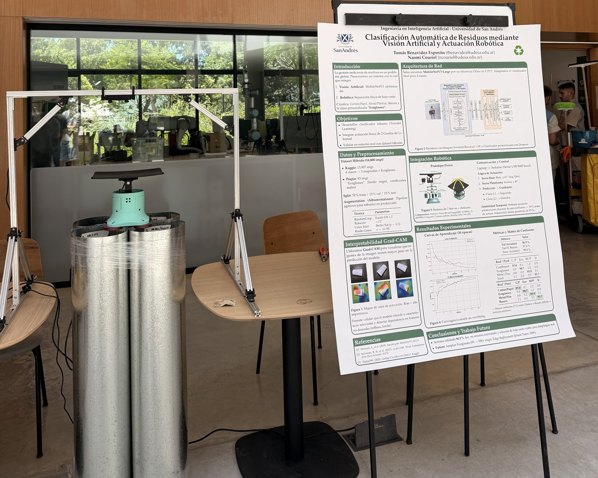
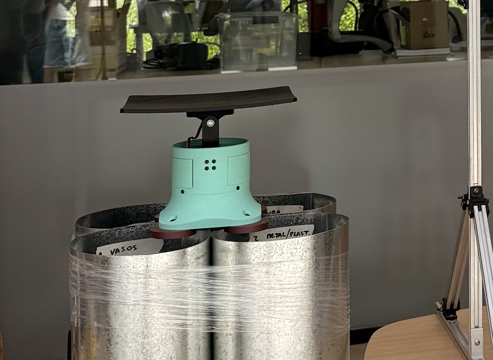

# Recyclable Waste Classifier

**MobileNetV3 transfer learning for 4-class waste sorting, with Grad-CAM interpretability and Arduino actuation.**

<p align="center">
  
  <br>
  <em>The working prototype next to the project poster — Universidad de San Andrés, Buenos Aires.</em>
</p>

An end-to-end computer vision system that identifies recyclable material from a live camera feed and physically sorts it. A MobileNetV3-Large classifier runs inference on each frame at ~30 ms on CPU, Grad-CAM exposes what the network is actually looking at, and a temporal-stability layer decides when a prediction is trustworthy enough to command a two-servo Arduino mechanism that drops the item into one of four bins.

The project covers the full path from raw dataset to deployed hardware: data consolidation, transfer learning, evaluation, model export (ONNX / TorchScript), real-time inference, and serial control of a physical actuator. It reaches **96.9% validation accuracy** and was validated on a real prototype built for roughly USD 150 in materials.

## 📄 Paper and Poster

The work is written up as an IEEE-format paper and was presented as a poster. Both are in the [`report/`](report/) folder (in Spanish):

| | Document | Contents |
|---|---|---|
| 📄 | **[IEEE paper — `report/cv_paper.pdf`](report/cv_paper.pdf)** | Full write-up: dataset construction, architecture, training strategy, confusion matrices, architecture comparison, inference benchmarks, domain-shift analysis and Grad-CAM failure analysis |
| 📊 | **[Poster — `report/cv_poster.pdf`](report/cv_poster.pdf)** | Single-page summary presented at the Universidad de San Andrés poster session |

> *Clasificación Automática de Residuos mediante Visión Artificial y Actuación Robótica* — Tomás Benavidez Esposito, Naomi Couriel. Ingeniería en Inteligencia Artificial, Universidad de San Andrés, Buenos Aires, Argentina.

An English technical report covering the same ground is in [`PROJECT_REPORT.md`](PROJECT_REPORT.md).

---

## Table of Contents

- [What it does](#what-it-does)
- [Results](#results)
- [The prototype](#the-prototype)
- [Architecture](#architecture)
- [Repository layout](#repository-layout)
- [Getting started](#getting-started)
- [Real-time inference](#real-time-inference)
- [Arduino integration](#arduino-integration)
- [Training](#training)
- [Engineering notes](#engineering-notes)
- [Documentation](#documentation)

---

## What it does

The classifier distinguishes four waste categories:

| ID | Class | Contents |
|----|-------|----------|
| 0 | `cardboard_paper` | Cardboard and paper |
| 1 | `ecoglasses` | Reusable eco-cups used on campus (custom dataset) |
| 2 | `metal_plastic` | Metal and conventional plastic |
| 3 | `trash` | Non-recyclable waste (glass mapped here) |

Around that model sit four subsystems:

- **Training pipeline** — transfer learning on MobileNetV3-Large with cosine LR annealing, label smoothing, mixed-precision training and early stopping, driven entirely from a YAML config.
- **Interpretability** — Grad-CAM heatmaps from the last convolutional block, available offline and overlaid live on the camera feed.
- **Real-time inference** — webcam and stereo-camera support, digital zoom, empty-tray detection, and a temporal stability filter.
- **Hardware control** — serial link to an Arduino Nano driving two servos that route each item into one of four quadrants.

## Results

Trained for 30 epochs on a hybrid dataset of **14,094 images** (9,799 train / 2,100 val / 2,100 test).

| Metric | Value |
|--------|-------|
| **Validation accuracy** | **96.90%** |
| **Validation F1-macro** | **97.65%** |
| Training accuracy | 98.84% |
| Backbone | MobileNetV3-Large, ImageNet pretrained (5.4M params — 4.2M backbone, 1.2M head) |
| Input resolution | 224 × 224 |
| Inference | 28–32 ms/image on CPU (i5-8250U) · 4–6 ms on GPU (GTX 1050) · ~30 FPS live |

The ~2% gap between training and validation accuracy indicates the model generalises without significant overfitting.

### Normalised confusion matrix (validation, %)

| Actual ＼ Predicted | cardboard_paper | ecoglasses | metal_plastic | trash |
|---|---|---|---|---|
| **cardboard_paper** | **97.8** | 0.1 | 1.2 | 0.9 |
| **ecoglasses** | 0.0 | **98.7** | 1.3 | 0.0 |
| **metal_plastic** | 0.8 | 0.2 | **95.9** | 3.1 |
| **trash** | 1.1 | 0.0 | 3.2 | **95.7** |

Residual errors concentrate between `metal_plastic` and `trash` (3.1–3.2%), driven by the high intra-class variability of "trash" and the visual similarity between crumpled plastics and general waste.

### Why MobileNetV3-Large

| Model | Val accuracy | Params | Inference |
|-------|--------------|--------|-----------|
| MobileNetV2 | 94.2% | 3.5M | 22 ms |
| MobileNetV3-Small | 93.8% | 2.5M | 18 ms |
| **MobileNetV3-Large** | **96.9%** | **5.4M** | **30 ms** |
| ResNet50 | 97.1% | 25.6M | 68 ms |

ResNet50 is marginally more accurate (+0.2%) at 5× the parameters and 2× the latency — not a worthwhile trade for embedded deployment.

<p align="center">
  
</p>

### Domain shift: the honest result

The model was also tested on **95 ecoglasses images captured in a different environment** (a tray under variable natural light, rather than the prototype's matte-black platform). Accuracy dropped to **58.9%** (56/95), with **38.9% of images misclassified as `metal_plastic`**.

Grad-CAM explains why:

<p align="center">
  
</p>

- **Correct predictions** — activation follows the structural silhouette of the cup: vertical edges and the upper rim, correctly ignoring the tray background.
- **Failures** — intense specular highlights from natural light dominate the activation map. Because `metal_plastic` was trained on reflective surfaces (cans, bottles), the network learned to associate strong reflections with that class. This is **texture bias winning over shape** under domain shift.

Rejecting low-confidence predictions with a 0.85 threshold raises precision from 58.9% to **78.4%**, at the cost of rejecting 31% of samples. Correct predictions average 0.89 ± 0.08 confidence; errors average 0.72 ± 0.12.

A fine-tuning pass on the ecoglasses subset alone was attempted and **rejected**: it made things worse (58.9% → 46.3%) through catastrophic forgetting of the other three classes. The original checkpoint is the one shipped. See [`archive/REALTIME_DETECTION_GUIDE.md`](archive/REALTIME_DETECTION_GUIDE.md).

## The prototype

<p align="center">
  
</p>

Two degrees of freedom are enough to reach four bins. The **base servo** rotates the whole mechanism ±45° about the vertical axis to pick the left or right quadrant; the **platform servo** then tilts the deposit surface ±40° to throw the item forward or backward. Running them in sequence addresses any of the four bins arranged radially around the base.

| Component | Spec |
|-----------|------|
| Microcontroller | Arduino Nano R3 (ATmega328P, 16 MHz, USB–FT232) |
| Actuators | 2 × Servo 450FBB (high-torque analogue, metal gears) |
| Power | LiPo 7.4 V (2S) 1000 mAh 20C, regulated |
| Structure | 6 mm laser-cut MDF, M3 fasteners |
| Camera | Intel RealSense D435 stereo, 50 cm above the platform, tilted 25° |
| Platform | 25 × 25 cm, matte black to suppress reflections |
| Bins | 4 × 15 cm diameter, arranged at 90° |
| Link | USB serial, 9600 baud, one byte per class |
| Cycle time | ~3 s per item |
| Material cost | ~USD 150 |

## Architecture

```
Camera frame
     │
     ├─► stereo split (optional) ─► digital zoom ─► empty-tray check
     │                                                    │
     │                                              tray empty? ──► skip + reset state
     │                                                    │
     ├─► preprocessing (resize 224, ImageNet normalisation)
     │
     ├─► MobileNetV3-Large ─► softmax ─► (class_id, confidence)
     │                    └─► Grad-CAM ─► heatmap overlay
     │
     ├─► temporal stability filter (same class held ≥ 4 s above threshold)
     │
     └─► serial write (0-3) ─► Arduino ─► 2× servo ─► physical bin
```

## Repository layout

```
├── report/            IEEE paper and conference poster (PDF)
├── src/
│   ├── data/          Dataset classes, preprocessing, augmentation
│   ├── models/        MobileNetV3 architecture and classification head
│   ├── training/      Trainer loop, losses, metrics, callbacks
│   ├── inference/     Predictor, camera runners, Grad-CAM
│   ├── utils/         Config loading, logging, visualisation
│   └── arduino/       Sketches for the Arduino Nano controller
├── notebooks/         01 data prep · 02 training · 03 inference demo · 04 full pipeline
├── configs/           mobilenet_config.yaml — all hyperparameters
├── data/              raw / processed splits / custom ecoglasses images
├── outputs/           exported models (ONNX, TorchScript)
├── assets/            Figures used in the documentation
└── archive/           Development notes and one-off experiment scripts
```

### Source modules

| Module | Responsibility |
|--------|----------------|
| `src/data/dataset.py` | PyTorch `Dataset` implementations |
| `src/data/preprocessing.py` | Class consolidation and train/val/test splitting |
| `src/data/augmentation.py` | Train and eval transform pipelines |
| `src/models/mobilenet.py` | MobileNetV2 / V3-Small / V3-Large with a custom head |
| `src/training/trainer.py` | Training loop with AMP and scheduling |
| `src/training/losses.py` | Cross-entropy and focal loss |
| `src/training/metrics.py` | Accuracy, precision, recall, F1 |
| `src/training/callbacks.py` | Early stopping and checkpointing |
| `src/inference/predictor.py` | Single-image inference API |
| `src/inference/camera.py` | Baseline webcam loop |
| `src/inference/gradcam.py` | Grad-CAM implementation |
| `src/inference/camera_gradcam.py` | Camera loop with Grad-CAM, stability filter and Arduino output |

## Getting started

```bash
git clone https://github.com/naomicouriel/recyclable-waste-classifier.git
cd recyclable-waste-classifier
pip install -r requirements.txt
```

> The trained `best_model.pt` checkpoint is not committed (size). The exported **ONNX** and **TorchScript** models are, under `outputs/exports/`.

### Single-image prediction

```python
from src.inference.predictor import RecyclingPredictor

predictor = RecyclingPredictor(model_path='outputs/checkpoints/best_model.pt', device='cpu')
result = predictor.predict('path/to/image.jpg')

# {'class_id': 1, 'class_name': 'ecoglasses', 'confidence': 0.85, 'probabilities': [...]}
```

### Batch prediction

```bash
python batch_predict.py --input_dir data/custom/ecoglasses --output_csv predictions.csv
python visualize_predictions.py   # renders a correct/incorrect grid
```

### Interactive demo

`notebooks/03_inference_demo.ipynb` is the main entry point. It loads the trained model, runs static-image and Grad-CAM predictions, opens the live camera loop, and exposes manual controls for the Arduino serial link.

## Real-time inference

```python
from src.inference.camera_gradcam import CameraInferenceWithGradCAM

# Standard webcam
camera = CameraInferenceWithGradCAM(predictor, camera_id=0, enable_gradcam=True)
camera.run()

# Stereo camera — process only one of the two side-by-side views
camera = CameraInferenceWithGradCAM(
    predictor,
    camera_id=0,
    enable_gradcam=True,
    stereo_mode='left',       # or 'right'
)
camera.run()
```

With hardware attached:

```python
arduino = ArduinoController(port='COM3', baudrate=9600)

camera_arduino = CameraInferenceWithArduino(
    predictor,
    arduino,
    camera_id=0,
    stability_duration=4.0,      # seconds of consistent classification before acting
    stereo_mode='left',
    black_threshold=0.7,         # 70% dark pixels ⇒ tray considered empty
    brightness_threshold=40,     # max brightness for a pixel to count as "dark"
    min_confidence=0.5,          # 0.5–0.6 for ecoglasses, 0.7 as a general default
)
camera_arduino.run()
```

### Keyboard controls

| Key | Action |
|-----|--------|
| `q` | Quit |
| `g` | Toggle Grad-CAM overlay |
| `s` | Save current frame |
| `+` / `=` | Zoom in (up to 3.0×) |
| `-` / `_` | Zoom out |

## Arduino integration

1. Flash `src/arduino/serial_instructions.ino` from the Arduino IDE.
2. Connect the board over USB and identify the serial port:
   - Windows — `COM3`, `COM4`, …
   - Linux — `/dev/ttyUSB0`, `/dev/ttyACM0`
   - macOS — `/dev/tty.usbserial-*`
3. Pass that port to `ArduinoController(port=..., baudrate=9600)`.

The host writes a single class ID (`0`–`3`) over serial. The sketch validates the byte, rotates the base servo to the target quadrant, tilts the platform, waits 2 seconds for the item to fall, and returns to neutral — discarding invalid commands for robustness.

```
┌─────────┬─────────┐
│    0    │    1    │   0: cardboard_paper
│         │         │   1: ecoglasses
├─────────┼─────────┤   2: metal_plastic
│    2    │    3    │   3: trash
└─────────┴─────────┘
```

Sketches in `src/arduino/`:

| File | Purpose |
|------|---------|
| `serial_instructions.ino` | Production sketch — reads class IDs over serial and drives the servos |
| `classification_tester.ino` | Verifies coordinated movement of both servos |
| `arduino_tester.ino` | Minimal hardware smoke test |

## Training

Run the notebooks in order:

1. `notebooks/01_data_preparation.ipynb` — download, consolidate the six source classes into four, and write the splits.
2. `notebooks/02_train_mobilenet.ipynb` — train and export the model.

All hyperparameters live in `configs/mobilenet_config.yaml`: Adam at 1e-3 with `CosineAnnealingLR`, cross-entropy with label smoothing (ε = 0.1), weight decay 1e-4, dropout 0.2, batch size 64, 30 epochs. All layers are unfrozen — preliminary experiments showed that freezing the backbone hurt significantly, since waste items look nothing like ImageNet's natural objects.

Augmentation (Albumentations): `RandomResizedCrop` at scale 0.8–1.2, ±15° rotation, horizontal flip (p = 0.5), brightness/contrast/saturation/hue jitter (p = 0.5), and Gaussian noise for robustness to low-quality sensors.

## Engineering notes

These are the problems that only appeared once the model met real hardware.

**Temporal stability.** A per-frame classifier fires 30 commands per second at a servo. The stability filter tracks recent high-confidence predictions and only emits a serial instruction once the same class has held for 4–5 consecutive seconds, then suppresses repeats until the classification changes.

```
Frame 1: metal_plastic (0.85) ─┐
Frame 2: metal_plastic (0.88)  ├─ accumulating…
Frame 3: metal_plastic (0.82)  │
Frame 4: metal_plastic (0.90)  ├─ 4 seconds reached ✓
Frame 5: metal_plastic (0.87) ─┘  └─► send class 2 to Arduino
Frame 6: metal_plastic (0.91) ──── suppressed (already sent)
Frame 7: ecoglasses    (0.75) ─┐
Frame 8: ecoglasses    (0.80)  ├─ accumulating new class…
```

**Empty-tray detection.** With nothing on the tray the model still returns its most confident guess, which moved the servos on empty air. Each frame is checked for the proportion of dark pixels; above `black_threshold` the frame is skipped. This doubles as a state reset, so the same item can be placed, removed and placed again and still be detected the second time.

**Stereo cameras.** A stereo camera delivers two views in one side-by-side frame, which made digital zoom crop sideways across the seam. The pipeline now extracts a single view before any other processing.

**Confidence threshold.** Exposed as `min_confidence` rather than hard-coded: 0.5–0.6 recovers difficult reflective objects such as the ecoglasses, 0.7–0.8 suppresses false positives on easier classes.

## Documentation

| Document | Contents |
|----------|----------|
| [`report/cv_paper.pdf`](report/cv_paper.pdf) | IEEE-format paper (Spanish) |
| [`report/cv_poster.pdf`](report/cv_poster.pdf) | Conference poster (Spanish) |
| [`PROJECT_REPORT.md`](PROJECT_REPORT.md) | English technical report — dataset, architecture, training configuration, evaluation, deployment |
| [`GRADCAM_GUIDE.md`](GRADCAM_GUIDE.md) | How Grad-CAM works here and how to read the heatmaps |
| [`archive/`](archive/) | Development notes, the rejected fine-tuning experiment, and one-off analysis scripts |

## Limitations and future work

- **Domain sensitivity** — accuracy falls to 58.9% on ecoglasses photographed outside the deployment environment. More diverse ecoglasses data (varied backgrounds, mixed lighting, different distances and angles, dirty and stacked cups) is the first fix; domain adaptation or synthetic augmentation the second.
- **One object at a time** — the platform processes a single item per cycle, capping throughput. An object detector (YOLO-family) would allow several items per frame.
- **Tethered inference** — the model runs on a laptop. Migrating to a Jetson Nano or Raspberry Pi would make the bin fully self-contained.
- **Quantisation** — unexplored, and the obvious next step for latency and power on an edge device.

## Dependencies

PyTorch · torchvision · OpenCV · Albumentations · NumPy · pandas · scikit-learn · matplotlib · seaborn · Pillow · PyYAML · pyserial

Install with `pip install -r requirements.txt`.

## Authors

**Naomi Couriel** — [github.com/naomicouriel](https://github.com/naomicouriel)
**Tomás Benavidez Esposito**

Ingeniería en Inteligencia Artificial, Universidad de San Andrés, Buenos Aires, Argentina.
